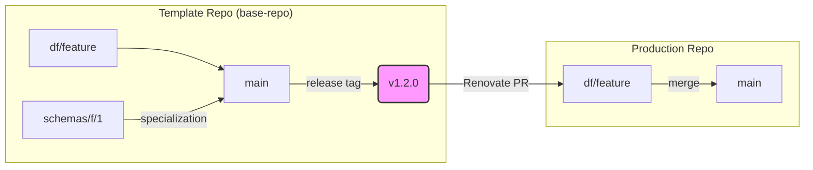

# System Architecture Overview

This document provides a high-level overview of the project's architecture and operational philosophy. The goal is for a new developer to understand the system's fundamental concepts within 5-10 minutes.

## The "Template Factory" Concept

The most important thing to understand is that this repository (`base-repo`) does not contain a final product, but rather a **"Template Factory"**. Its responsibility is to produce and maintain templates from which actual "Production" repositories will later be created.

- **Template Repo (this repo):** The "source of truth" for CI/CD processes, release logic, build scripts, and common configurations.
- **Production Repo:** A repository derived from the template, containing specific business logic (e.g., a Go application, a schema definition).

## The Ecosystem of Repositories

The system is built from multiple interconnected repositories. Updates automatically propagate from the template repo to the production repos.

```mermaid
graph TD
    A[Template Repo (base-repo)] -- "Renovate updates" --> B(Production Repo 1);
    A -- "Renovate updates" --> C(Production Repo 2);
    A -- "Renovate updates" --> D(Production Repo N);
```

## The Engine of Automation: Renovate

The heart of the system is **Renovate**. This tool monitors the `release` tags of the template repository, and when it detects a new version, it automatically opens Pull Requests (PRs) on the production repositories.

This ensures that central logic (e.g., a security fix in the CI process) automatically and consistently reaches all products with minimal human intervention.

## The Role of the Unified Compiler (`compiler.py`)

The system uses a single, unified `compiler.py` script, whose role is dual depending on the execution environment. This tool simultaneously represents the "template management engine" and the "product manufacturing payload."

1.  **Template Maintainer Role (executed in `base-repo`)**
    - **Responsibility:** Maintaining and versioning the template repository.
    - **Task:** Validating and "finalizing" the central `project.yaml` configuration file when a new version of the template is released. This process ensures the internal consistency of the template.

2.  **Product Manufacturer Role (executed in the derived production repo)**
    - **Responsibility:** The template's "payload." This is the tool that a production repo created from the template uses to produce its own final product (e.g., a digitally signed schema, a Go binary).
    - **Task:** Creating a digitally signed, counter-signed "artifact" from a specific source file within the production repo's own release process.

This unified approach ensures that production repositories always use exactly the same logic and tools to manufacture their own products as the template repo uses to maintain itself.

## The Path of Changes and the Branching Model

Changes follow a strictly defined path through the systems.



1.  **Development in the Template Repo:** Development takes place on `df/xxx` branches, which originate from `main` or a specialization branch (e.g., `schemas/f/1`).
2.  **Template Release:** A new `release` tag is created from changes merged into the `main` branch.
3.  **Distribution:** Renovate detects the new tag and opens a PR on the `df/xxx` development branches of the production repositories.
4.  **Integration into the Product:** Developers merge the update into their own work, then into the `main` branch, which triggers the product release.
