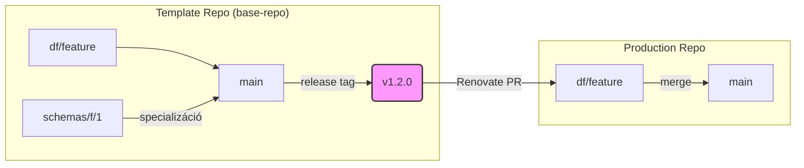

# Rendszer Architektúra Áttekintés

Ez a dokumentum a projekt magas szintű architektúráját és működési filozófiáját mutatja be. A cél, hogy egy új fejlesztő 5-10 perc alatt megértse a rendszer alapvető koncepcióit.

## A "Sablon Gyár" Koncepció

A legfontosabb megérteni, hogy ez a repository (`base-repo`) nem egy végterméket tartalmaz, hanem egy **"Sablon Gyár"** (Template Factory). A felelőssége, hogy olyan sablonokat gyártson és tartson karban, amelyekből később a tényleges "Termék Gyártó" (Production) repository-k jönnek létre.

- **Sablon Repo (ez a repo):** A CI/CD folyamatok, a release logika, a build scriptek és a közös konfigurációk "forrása" (source of truth).
- **Termelési Repo:** A sablonból származtatott, konkrét üzleti logikát (pl. egy Go alkalmazást, egy séma definíciót) tartalmazó repository.

## A Repók Ökoszisztémája

A rendszer több, egymással kapcsolatban álló repository-ból épül fel. A frissítések a sablon repóból automatikusan terjednek a termelési repók felé.

```mermaid
graph TD
    A[Template Repo (base-repo)] -- "Renovate frissíti" --> B(Production Repo 1);
    A -- "Renovate frissíti" --> C(Production Repo 2);
    A -- "Renovate frissíti" --> D(Production Repo N);
```

## Az Automatizáció Motorja: Renovate

A rendszer lelke a **Renovate**. Ez az eszköz figyeli a sablon repository `release` tag-jeit, és amikor új verziót észlel, automatikusan Pull Requesteket (PR) nyit a termelési repókon.

Ez biztosítja, hogy a központi logika (pl. egy biztonsági javítás a CI folyamatban) automatikusan és konzisztensen eljusson minden termékhez, minimális emberi beavatkozással.

## Az Egységes Compiler (`compiler.py`) Szerepe

A rendszer egyetlen, egységes `compiler.py` scriptet használ, amelynek a szerepe a futási környezettől függően kettős. Ez az eszköz egyszerre képviseli a "sablont kezelő motort" és a "terméket gyártó hasznos terhet".

1.  **Sablon Karbantartó Szerepkör (a `base-repo`-ban futtatva)**
    - **Felelősség:** A sablon repository karbantartása és verziózása.
    - **Feladat:** A `project.yaml` központi konfigurációs fájl validálása és "lezárása" (finalizing) a sablon egy új verziójának kiadásakor. Ez a folyamat biztosítja a sablon belső konzisztenciáját.

2.  **Termék Gyártó Szerepkör (a származtatott termelési repóban futtatva)**
    - **Felelősség:** A sablon "hasznos terhe" (`payload`). Ez az az eszköz, amit a sablonból létrehozott termelési repo a saját végtermékének (pl. aláírt séma, Go bináris) előállítására használ.
    - **Feladat:** Egy konkrét forrásfájlból egy digitálisan aláírt, ellenjegyzett "műtárgy" (artifact) létrehozása a termelési repo saját release folyamatában.

Ez az egységes megközelítés biztosítja, hogy a termelési repók mindig pontosan ugyanazt a logikát és eszközt használják a saját termékük gyártására, mint amit a sablon repo használ a saját maga karbantartására.

## A Változások Útja és a Branching Modell

A változások egy szigorúan definiált útvonalon haladnak a rendszereken keresztül.



1.  **Fejlesztés a Sablon Repóban:** A fejlesztés `df/xxx` ágakon történik, amelyek a `main` vagy egy specializációs ágból (pl. `schemas/f/1`) indulnak.
2.  **Sablon Release:** A `main` ágra merge-elt változásokból egy új `release` tag jön létre.
3.  **Terjesztés:** A Renovate észleli az új taget, és PR-t nyit a termelési repók `df/xxx` fejlesztési ágaira.
4.  **Integráció a Termékbe:** A fejlesztők beolvasztják a frissítést a saját munkájukba, majd a `main` ágra, ami a termék kiadását triggereli.
